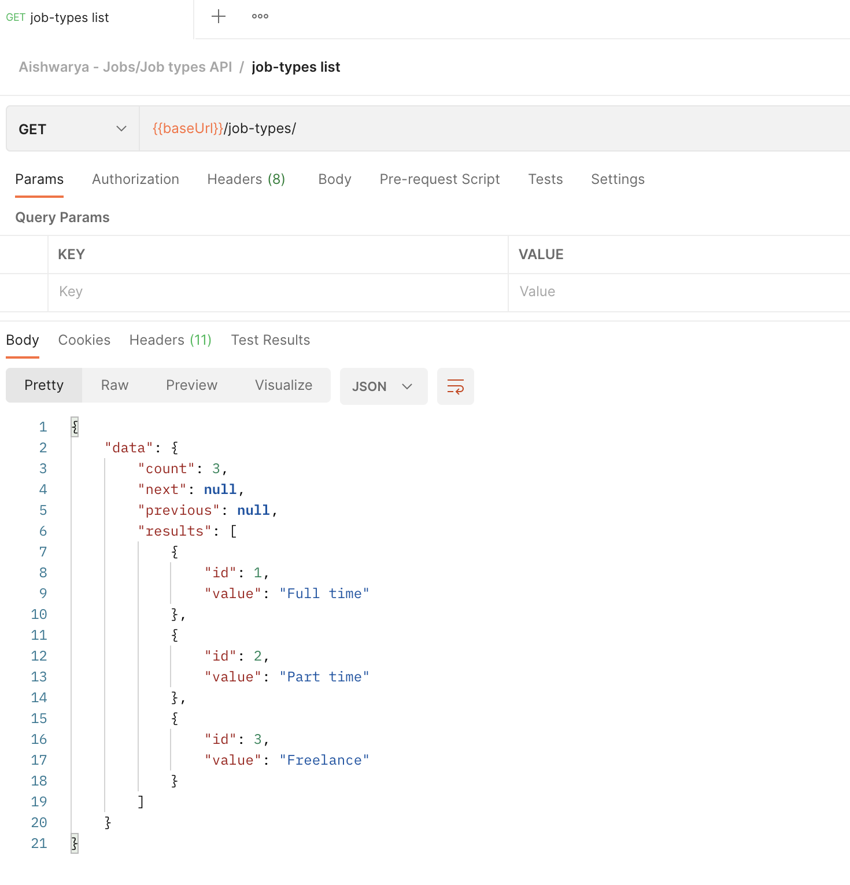
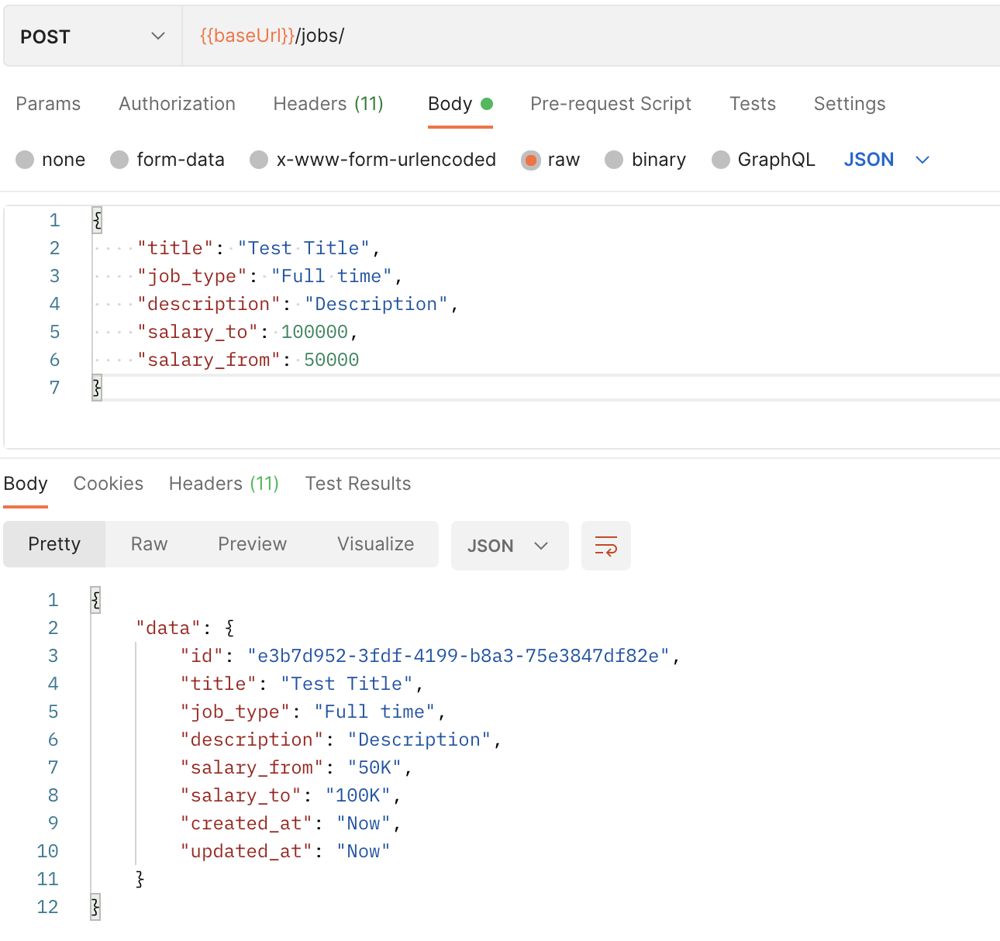
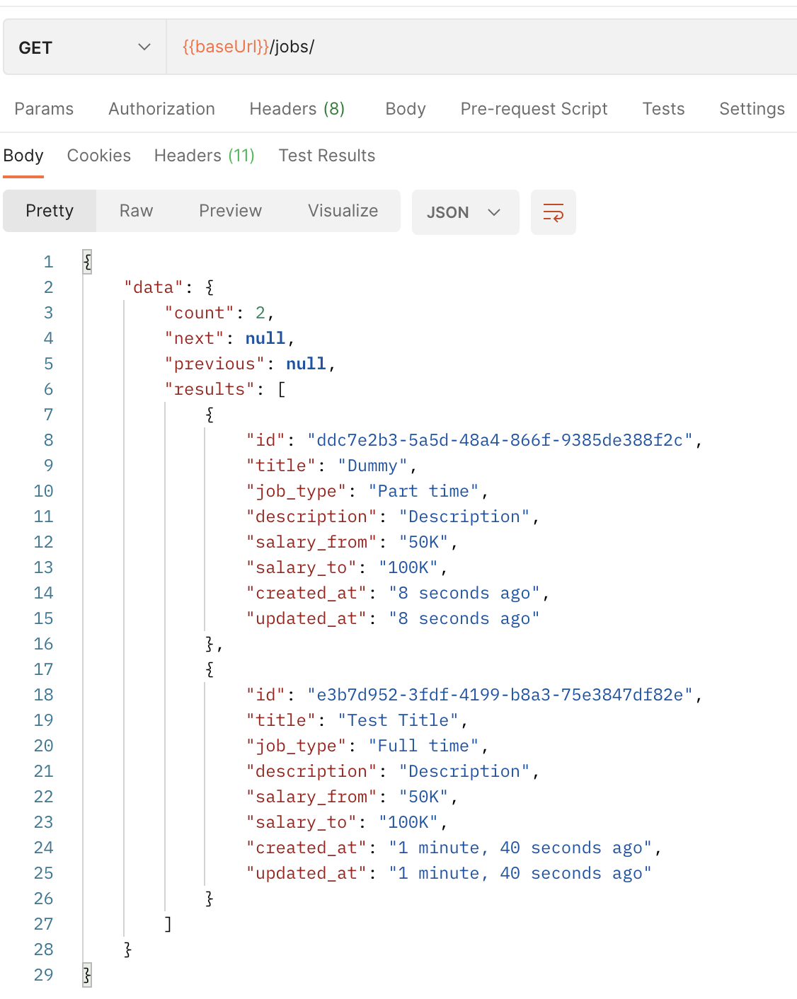

# django-rest-technical-test

A Django rest app to create, update and delete job details. The app currently uses the Django rest framework for the api, Docker to spin up a local MYSQL database and has a swagger implementation to document and test api. An app demo has been deployed on Heroku.

Author : Aishwarya Lakshminarasimhan

# App Demo
Hosted on Heroku : https://django-rest-app.herokuapp.com/api/v1/

API endpoints -

- Swagger UI : https://django-rest-app.herokuapp.com/api/v1/doc/
- Redoc UI : https://django-rest-app.herokuapp.com/api/v1/redoc/

<b> JOBS - GET/POST</b>
- ```/api/v1/jobs/```

<b> JOBS - GET/PUT/DELETE</b>
- ```/api/v1/jobs/{id}```

<b> JOB_TYPES - GET</b>
- ```/api/v1/job-types/```

# How to deploy app locally

1. Clone repository
```
git clone https://github.com/Aishwarya26l/django-rest-test.git 
cd django-rest-test
```
2. Add a ```.env ``` file following the ```.env-local.example``` structure to house all your environment variables. 
3. Create a new virtual environment, using venv. This will ensure our package configuration is isolated from other projects.
```
python3 -m venv env
source env/bin/activate
```
4. Install requirements
```
pip install -r requirements.txt
```
5. Run docker compose to spin up MySQL DB resource for the project
```
docker compose up -d
```
6. Once docker is up and running, run your migrations and seed intial values into the DB.
```
python manage.py migrate
python manage.py loaddata seed.json
```
7. Your local DB can be accessed from ```Adminer``` on ```http://localhost:8081```. Login credentials would be the ones used in ```.env``` file.
8. Run application.
```
python manage.py runserver
```
<b> Your app can be viewed on - ```http://localhost:8080/``` </b>

 ---
# Run tests
1. You can run tests for the app using 
```
python manage.py test --keepdb
```

or if you want to run test coverage - 
```
coverage run manage.py test --keepdb
coverage report
```

# Postman collection

<h2> 1. GET Job types </h2>



<h2> 2. CREATE/POST Job</h2>



<h2> 3. GET Jobs </h2>



<h2> 4. GET Job by id </h2>


<h2> 5. UPDATE/PUT Job by id </h2>


<h2> 6. GET Job types </h2>


# Table schemas

jobs : id , title, description, job_type, salary_from, salary_to, created_at, updated_at

```
CREATE TABLE `jobs_job` (
  `id` char(32) NOT NULL,
  `title` varchar(150) NOT NULL,
  `job_type_id` int(11) NOT NULL,
  `created_at` datetime(6) NOT NULL,
  `description` varchar(250) NOT NULL,
  `salary_from` double NOT NULL,
  `salary_to` double NOT NULL,
  `updated_at` datetime(6) NOT NULL,
  PRIMARY KEY (`id`),
  KEY `jobs_job_job_type_id_f4ebaf1f_fk_jobs_jobtype_id` (`job_type_id`),
  CONSTRAINT `jobs_job_job_type_id_f4ebaf1f_fk_jobs_jobtype_id` FOREIGN KEY (`job_type_id`) REFERENCES `jobs_jobtype` (`id`)
) ENGINE=InnoDB DEFAULT CHARSET=latin1;
```
job_types: id, value
```
CREATE TABLE `jobs_jobtype` (
  `id` int(11) NOT NULL,
  `value` varchar(150) NOT NULL,
  PRIMARY KEY (`id`)
) ENGINE=InnoDB DEFAULT CHARSET=latin1;
```